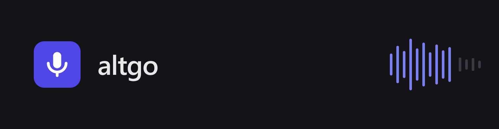

# altgo



[](https://github.com/ouyangjiahong26/altgo/actions/workflows/ci.yml)
[](https://ouyangjiahong26.github.io/altgo/)
[](https://github.com/ouyangjiahong26/altgo/releases)
[](LICENSE)

**altgo** 是桌面语音转文字工具。按住触发键说话，松开即自动完成录音、转写与可选润色，结果写入系统剪贴板，并在屏幕底部的悬浮窗中单行展示。



支持 **Linux**（Ubuntu 22.04+，x86_64 / aarch64）与 **Windows 10+**（x86_64 / arm64），暂不支持 macOS。

- [在线文档](https://ouyangjiahong26.github.io/altgo/)
- [Releases 下载](https://github.com/ouyangjiahong26/altgo/releases)
- [问题反馈](https://github.com/ouyangjiahong26/altgo/issues)

## 功能

- 按住右 Alt 说话，松开自动转写
- 双击右 Alt 进入连续录音，再单击一次停止
- 本地 SenseVoice 转写（内嵌 sherpa-onnx）：模型常驻加载、响应快，可在设置页下载与管理模型
- LLM 润色，支持 OpenAI 兼容 API 与 Anthropic Messages API
- 转写结果自动写入剪贴板，并在屏幕底部悬浮窗以单行胶囊扫一眼确认；全文可在主窗历史中查看、复制
- 自动检查更新：启动时静默检查并在有新版时提示，设置页可手动检查（按安装方式就地更新或跳转下载页）
- 托盘图标：显示主窗口或退出应用
- 本地转写历史：查看、复制、删除、清空、重新润色
- 只保存文本，从不保存音频

## 安装

### Linux

安装前把当前用户加入 `input` 组，否则无法读取键盘设备；随后注销重新登录：

```bash
sudo usermod -aG input "$USER"
```

然后：

1. 从 [Releases](https://github.com/ouyangjiahong26/altgo/releases) 下载对应架构的 `.deb`、`.rpm` 或 `.AppImage`。
2. 安装下载的包，例如：

   ```bash
   sudo apt install ./altgo_*.deb
   # 或
   sudo dnf install ./altgo-*.rpm
   ```

   `.AppImage` 免安装，加执行权限直接运行：

   ```bash
   chmod +x altgo_*.AppImage && ./altgo_*.AppImage
   ```

   与 `.deb`/`.rpm` 不同，AppImage 不自动解析依赖；缺库时参照下方依赖说明自行安装。

3. 重新登录后启动 altgo，在设置页完成转写配置。

<details>
<summary>依赖说明</summary>

`.deb` 与 `.rpm` 已声明覆盖桌面集成、音频、剪贴板与 `evtest` 的依赖。Wayland 会话需确保已安装 `evtest`，且当前用户可读 `/dev/input/event*`。

</details>

### Windows

从 [Releases](https://github.com/ouyangjiahong26/altgo/releases) 下载安装包：

- `*-setup.exe`（NSIS 安装器）：双击安装，适合多数用户。
- `*.msi`：面向需要 MSI 部署的企业环境。

x64 与 arm64 按设备架构选择对应包。安装后从开始菜单启动 altgo，在设置页完成转写配置。

## 快速开始

启动应用后，在 **设置** 页完成：

1. 下载并选择本地 SenseVoice 模型。
2. 按需设置润色档位与润色服务。
3. 确认触发键（默认右 Alt）。
4. 点击保存。

长按模式（默认）：

```text
按下右 Alt → 开始录音 → 松开右 Alt → 转写 → 润色（可选）→ 剪贴板 + 悬浮窗
```

较长内容可双击右 Alt 进入连续录音，单击一次停止：

```text
双击右 Alt → 连续录音 → 单击右 Alt → 转写 → 润色（可选）→ 剪贴板 + 悬浮窗
```

转写历史默认保存在：

```text
~/.config/altgo/history.json
```

## 文档

- [在线文档](https://ouyangjiahong26.github.io/altgo/)：快速上手、使用与架构
- [配置指南](https://ouyangjiahong26.github.io/altgo/docs/configuration)：配置文件字段、环境变量与日志级别
- [FAQ](https://ouyangjiahong26.github.io/altgo/docs/faq)：按键、录音、转写、润色与剪贴板问题排查
- [`CONTRIBUTING.md`](CONTRIBUTING.md)：开发环境、构建、测试、CI 与发版
- [`docs/architecture.md`](docs/architecture.md) 与 [`AGENTS.md`](AGENTS.md)：系统架构与核心模块
- [`docs/README.md`](docs/README.md)：设计与规划文档索引
- [`CHANGELOG.md`](CHANGELOG.md)：版本历史

## 许可证

[MIT License](LICENSE)
